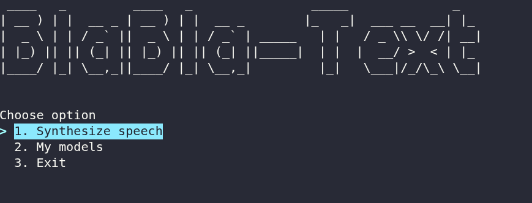
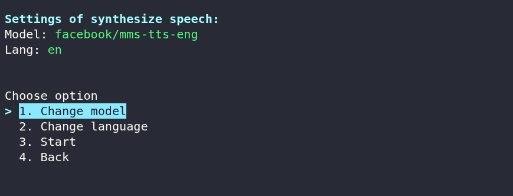

# BlaBla-Text 🎙️

**BlaBla-Text** is a command-line interface (CLI) application for local speech synthesis using TTS models from the Hugging Face Transformers library. It features user-friendly interactive menus, allowing you to manage languages ​​and models, as well as download new ones.

## Features 🚀

* **Text-based interface:** Convenient terminal-based control using keyboard shortcuts.
* **Multi-language support:** Support for a wide range of languages.
* **Model manager:** View a list of all installed models, with options to download or delete them.
* **Auto-save:** Settings and parameters are automatically saved to a configuration file.

---

## Roadmap 🎯

* ⭐ **100 stars** on GitHub - I'll create a graphical user interface (**GUI**)!
* ⭐ **150 stars** on GitHub - I'll add a text-based user interface (**TUI**)!
---

## Screenshots 📸 

* **Main program menu:**
  

* **Speech synthesis process:**
  

---

## Installation and Launch 🛠️ 

1. **Clone the repository:**
   ```bash
   git clone https://github.com/luzury-official/blabla-text.git
   cd blabla-text
   ```

2. **Install libraries:**
    ```bash
    pip install -r requirements.txt
    ```

3. **Run:**
    ```bash
    python cli.py
    ```